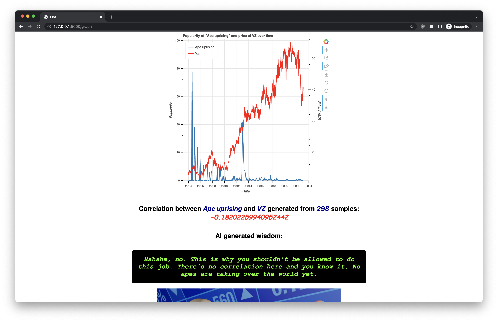
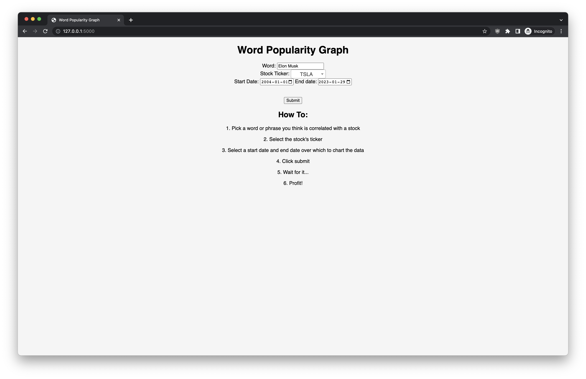
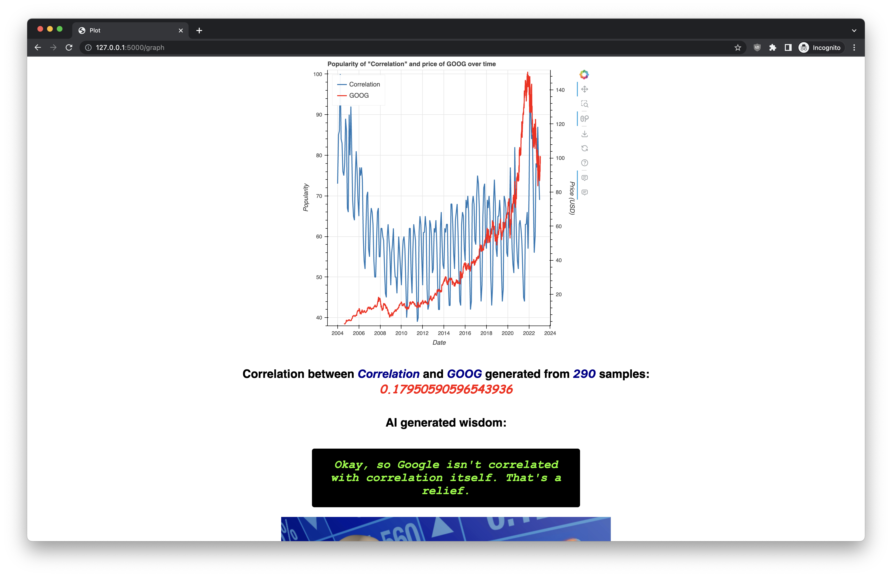
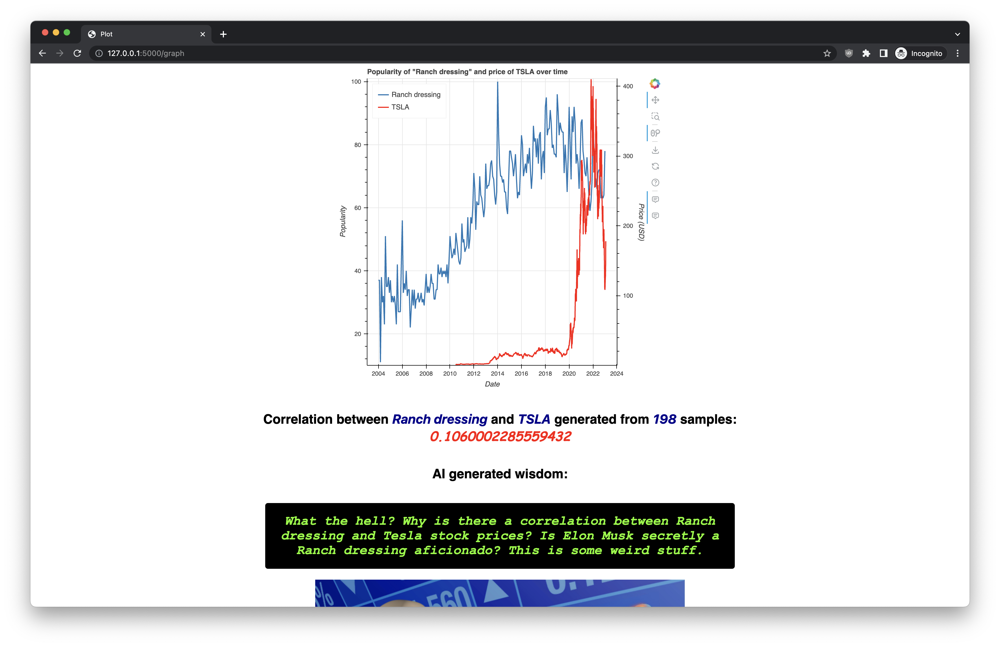
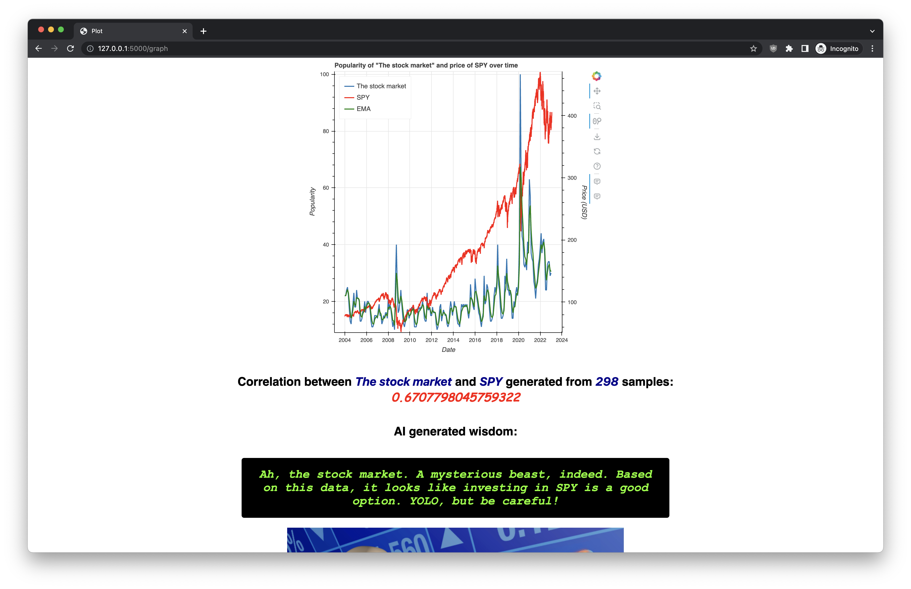

# stockbro.ai

🏆 Winner of the Best Newbie Hack at McHacks 10. 🎉

Project built for McHacks 10
by Thabnir, clarariachi, and Rain1618

## Inspiration

Money. Stonks. We like them.

Originally inspired by [a research paper][1] which found that the search volume of certain words associated with the economy (e.g. debt) could be indicative of the general direction of the stock market and predict future stock movements.
We wanted to extend this idea and see if we could find other keywords that may be indicative of the future of the stock market.
As data can be sometimes tedious to understand, we also built a bot that tells the user in no uncertain terms whether of not there is a correlation between the keyword and the stock (and occasionally _questions_ the thought process behind the user's selection). 

## What it does

stockbro.ai attempts to predict the stock market by finding obscure correlations between a stock's prices and Google Trends over time by calculating the Pearson correlation coefficient. Spoiler: it doesn't work. It knows it doesn't work. Whether stockbro.ai cares enough to tell you that it doesn't know what's going on or simply dons a cool professional guise as it shepherds you to financial ruin is up to chance.

## How we built it

We made a Flask app and used html + Bokeh to plot graphs showing correlations between a Google search's popularity over time and the associated stock's price. A variety of data science libraries like pandas along with yfinance and pytrends were used to retrieve and process the necessary data from Yahoo Finance and Google Trends respectively.

## Challenges we ran into

We first made our chatbot using Cohere, but had to redo it with OpenAI after the results produced by the trained Cohere model fell short of our expectations. The dataset we used to train the robot had to be manually created on the spot, as there weren't any preexisting datasets that quite fit our criteria of condescending, sarcastic and cynically humorous. Lastly, for our time-series prediction model, we were unable to obtain enough data to extract the features necessary to implement a proper Multi layer perceptron (MLP) algorithm and thus didn't feel comfortable using a model that would potentially generate innacurate information. Instead, we used an Exponential Moving Average (EMA) to help filter out the noise and daily fluctuations to obtain the long term trends. Moving averages have been traditionally used to analyze stock prices over en extended period of time and the EMA provides the added advantage of placing more weight on recent values. For any graph with a Pearson correlation above 0.5, we found that the EMA was reasonably reliable in predicting the general direction using our test data.

## Accomplishments that we're proud of

We're proud of being able to make a working project in under 24 hours by learning as we go, especially as none of us had extensive previous experience with any of the tools we used. We also found the robot very funny (unsurprising, given it was trained on insults _we_ wrote).

## What we learned

We had to read up on and implement a variety of data science concepts in order to process large amounts of data and create interactive visualizations of said data. Additionally, we learned how to use Flask, pandas, pytrends, yfinance, bokeh, NLP, basic HTML... and trained a little bot to say bad things! Most importantly, we learned that Stackoverflow takes you far in life.

## What's next for Stock Bro AI

I'll let _it_ tell you what's next: it won't stop making its "predictions"! More seriously, we will work on implementing a proper machine learning model (perhaps an MLP Classifier) as inspired by the literature and see if it is able to predict the up and downturns of the stock market more closely. If the urge strikes, we could also improve upon the aesthetics of the website.

## Screenshots

_stockbro.ai doesn't know what tendies are_

_stockbro.ai denies the 5G ape uprising_

_how to use the website_

_meta-correlation avoided successfully_

_elon musk ranch conspiracy_

_finally, some good financial advice! YOLO_

## References

[1]: https://doi.org/10.1038/srep01684
Preis, T., Moat, H. & Stanley, H. Quantifying Trading Behavior in Financial Markets Using Google Trends. Sci Rep 3, 1684 (2013). [DOI Link](https://doi.org/10.1038/srep01684)
